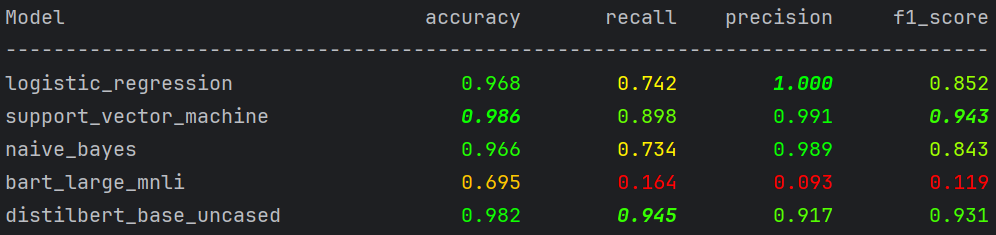

# sms_spam_classification
Running experiments on classifying spam messages in the "UCI SMS Spam Collection" dataset

## Data

The UCI spam collection can be downloaded [here](https://archive.ics.uci.edu/dataset/228/sms+spam+collection) as a ZIP
folder. Unpacking it to the `data/uci_spam_collection/` subdirectory should reveal 2 files: the `readme` file with
detailed information on the dataset and the `SMSSpamCollection` containing the actual data as tab-separated, headerless 
CSV with the label `spam` or `ham` in the first column and the corresponding SMS text in the second column.

Run `scripts/main01_pre_process_splits.py` to read in the dataset, run cleaning steps on the text messages and to
generate splits for traininhg and testing models. The splits are written to `data/splits`.

## Models

Our goal is to compare modern large language models with classical approaches from natural language processing. To this
end, we chose the following candidates for classifiers to distinct spam from ham messages.

### Classical

Each of the 3 classical approaches discussed uses Term Frequency - Inverse Document Frequency (TD-IDF) for 
preprocessing. With `TF(w, d)` being the frequency of word `w` in document `d` and with 
`IDF(w) = log(#d/1+#(d contains w))` scoring the rarity of words, the TD-IDF is defined as `TF(w, d)*IDF(w)`. Running
this transformation over all SMS texts and the words they contain allows us to transform each text into an array of word
scores that subsequent classifiers can learn on.

#### Logistic Regression

A linear classifier that learns weights `w` for each TF-IDF score array `x` and the calculates the sigmoid probability
`1/(1+exp(<w,x>+b))` with bias `b` to determine a probability that the corresponding message is spam. During training,
weights and biases are optimized to minimize binary cross-entropy between true and predicted labels.

At inference, the weights provided by the model can be interpreted as relevance of the word for the classification:
a positive weight can be considered pro "spam", a negative one pro "ham".

#### Supporting Vector Machine

Tries to separate classes by hyperplanes. Works on `<w,x>+b` just like logistic regression, but instead of modelling
probabilities for each word, it tries to maximize the margin between classes.

#### Naïve Bayes

A model based on the Bayes theorem `P(y|x)P(x) = P(y)P(x|y)` and the assumption that words are conditionally independent
given a class, i.e. `P(x|y) = P(x_0|y)*...*P(x_n|y)` where `x_i` is the TF-IDF score of the `i`-th word.

On training, use the relative frequency of positives in the training set as prior:

`P(y='spam') = #spam/#messages`

and let `TF(w,y)= total TF of word w in class y`, then determine the likelihood of each word per class via

`P(w_i|y) = (TF(w_i, y) + alpha)/(sum_i (TF(w_i, y) + alpha*V).`

At inference, calculate the log-probability for each class as

`log P(y) + sum_i x_i * log P(w_i|y)`

(this is the logarithm applied to Bayes theorem) and use the class with the highest probability as prediction.

### Large Language Models

#### Bart Large MNLI

A zero-shot classification model based on the BART transformer architecture, fine-tuned on the Multi-Genre Natural
Language Inference dataset. It is a natural language inference (NLI) model meaning it gets presented 2 text fragments,
a premise and a hypothesis, and its purpose is to decide whether the premise entails, contradicts or is neutral to the
hypothesis.

As a zero-shot model, it is not further fine-tuned on the dataset at hand. Instead, it is designed as a general-purpose
language model to be applied to texts that it did not see during training.

#### DistilBERT Base Uncased

A lighter version of the BERT model, meant to retain most of BERT's ability to understand language, but with reduced
size ("Base" as BERT-base) and without distinction between lower- or uppercase ("Uncased").

DisltilBERT is trained by _knowledge distillation_ from a larger, pretrained BERT model: a smaller architecture that 
learns to mimic the output of the larger model, given an input.

## Evaluations

We decided to work with [MLflow](https://mlflow.org/) to ease evaluation of the models. As long as training and testing 
pipelines are adjusted appropriately to provide hooks for parameters and models to be tracked, progress can be
monitored by running the MLflow browser UI.

To open up the MLflow UI, first make sure that the virtual environment is activated by running the command

```.\.venv\Scripts\activate```

on a command prompt located at the root directory of this project. Then change to directory `.\scripts` and run

```mlflow ui```

to initialise the MLflow server. Follow the instructions to open up the UI in the browser.

Alternatively, running `scripts/main07_compare_results` once all models were trained should yield a result of the 
following form:


